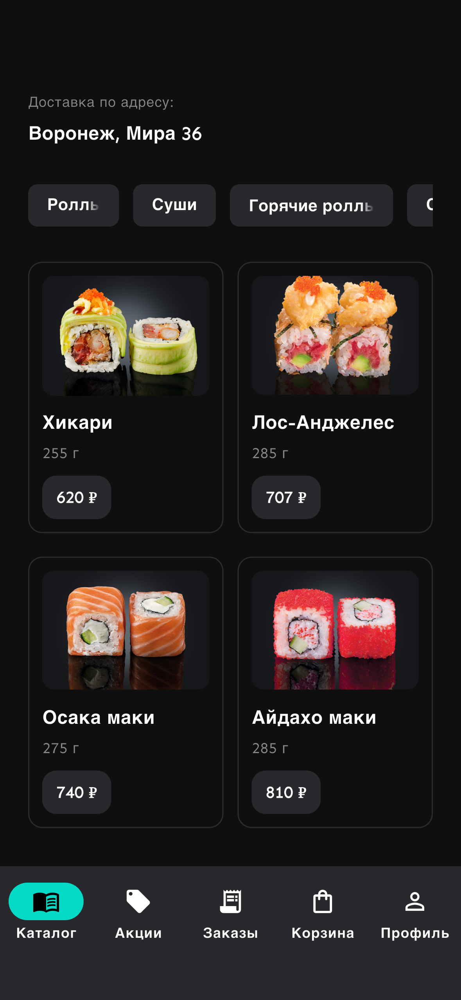
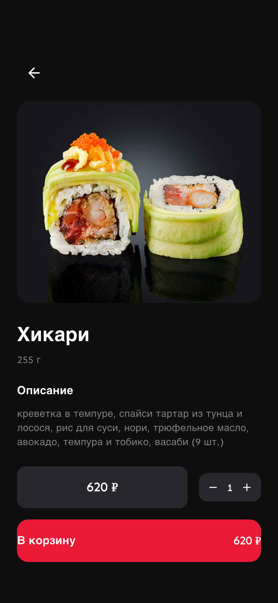
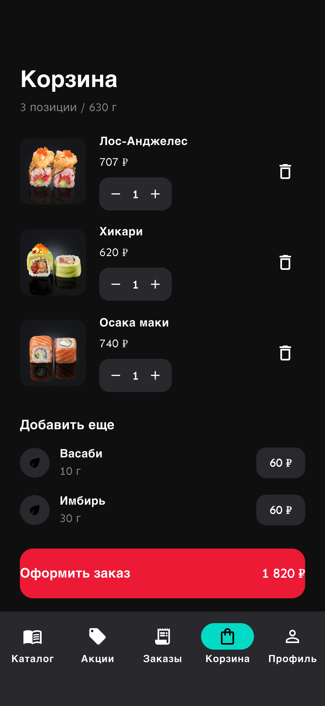
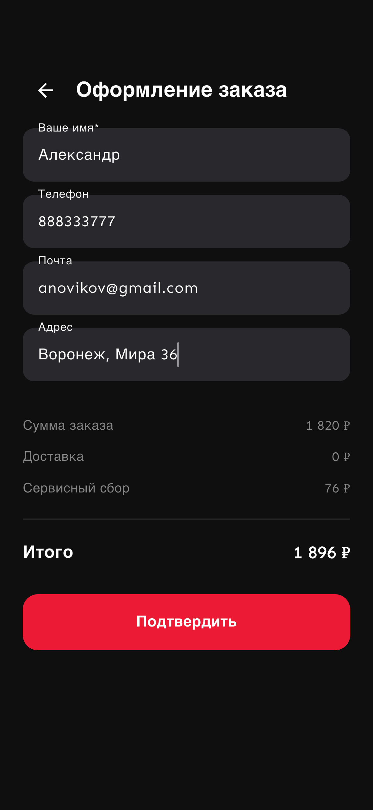
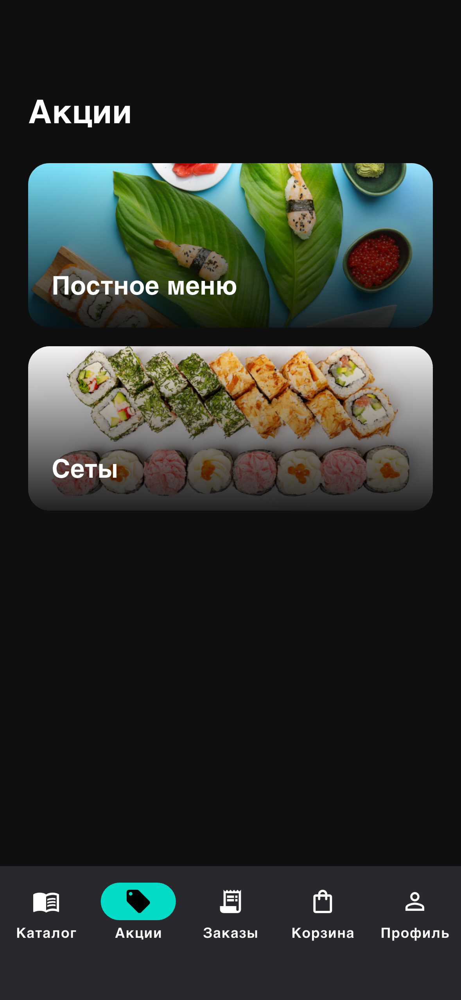
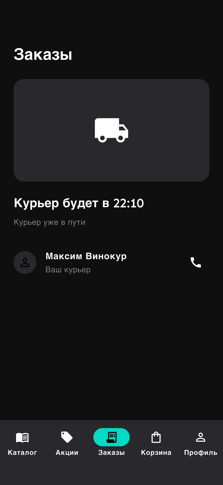
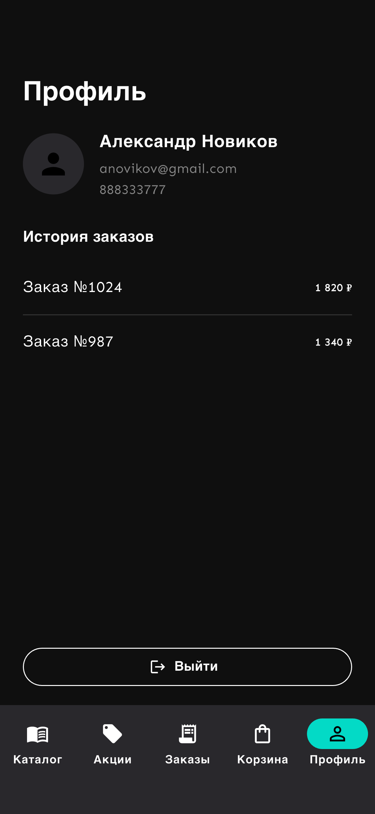
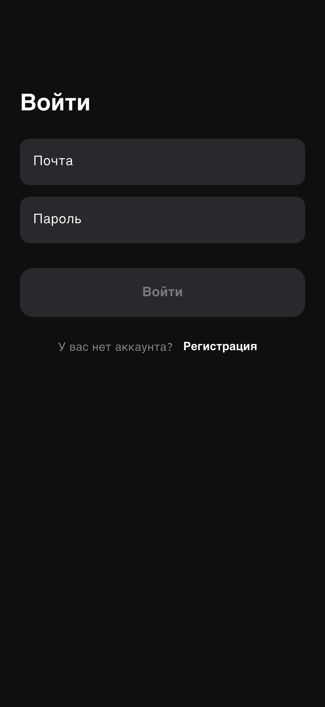
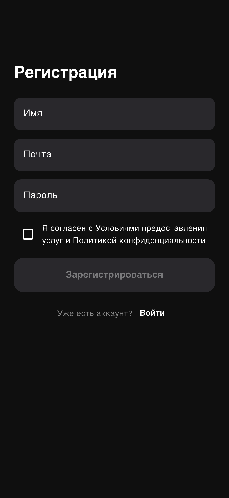

# Sushi Garden Flutter

A Russian-language sushi delivery app built in Flutter, following the Figma design spec with a full catalog → cart → checkout → orders flow. A cross-platform (iOS + Android) port of the [Sushi Garden iOS](../sushi-garden-ios) app.

---

## Screenshots

| Catalog | Product Detail | Cart |
|---------|----------------|------|
|  |  |  |

| Checkout | Promotions | Orders |
|----------|------------|--------|
|  |  |  |

| Profile | Login | Register |
|---------|-------|---------|
|  |  |  |

---

## Tech Stack

| Layer | Technology |
|-------|-----------|
| UI | Flutter, Material 3, dark theme |
| Language | Dart 3 |
| Navigation | GoRouter (named routes + shared bottom-nav shell) |
| State | Plain controllers + `StatefulWidget` (`CartController`, `CheckoutController`, `AuthController`) |
| Typography | `google_fonts` (Sen) |
| Data | In-memory fake repositories (`lib/data`) |
| Tests | `flutter_test` (unit + widget) + `integration_test` |

---

## Architecture

Feature-first layout under `lib/features/*`. Screens are thin widgets that read
immutable models from in-memory fake repositories and delegate behaviour
(validation, cart maths) to small plain-Dart controllers — the same controllers
the unit tests exercise directly.

### Layer overview

```
┌────────────────────────────────────────────┐
│                  main.dart                   │
│                     ↓                        │
│        SushiGardenApp (MaterialApp.router)   │
│                     ↓                        │
│        createRouter()  ── GoRouter           │
│   /splash /catalog /catalog/product/:id      │
│   /promos /orders /cart /checkout            │
│   /profile /login /register                  │
└───────────────────┬──────────────────────────┘
                    │ SushiBottomNav (5 tabs) navigates via context.go
        ┌───────────┴───────────────────────────┐
        │              Feature screens            │
        │                                         │
        │  CatalogScreen ──▶ ProductDetailScreen  │
        │  PromosScreen                           │
        │  CartScreen ──▶ CheckoutScreen          │
        │  OrdersScreen                           │
        │  ProfileScreen                          │
        │  LoginScreen ⇄ RegisterScreen           │
        └───────────┬─────────────────────────────┘
                    │ read models / drive controllers
        ┌───────────┴───────────────────────────┐
        │  Controllers          Fake data         │
        │  CartController        fake_catalog.dart │
        │  CheckoutController    fake_orders.dart  │
        │  AuthController        (Product, AddOn,  │
        │                         Promo, Order,    │
        │                         Delivery, …)     │
        └─────────────────────────────────────────┘
```

### Checkout flow

```
CatalogScreen
    │  tap a product card
    ▼
ProductDetailScreen  (QuantityStepper, "В корзину")
    │
    ▼
CartScreen  (seeded Figma items, add-ons, "Оформить заказ")
    │  context.go('/checkout')
    ▼
CheckoutScreen
    │  CheckoutController.canConfirm gates the button
    │  (name + valid phone + valid email + address)
    ▼
OrdersScreen  (courier tracking)
```

### Design fidelity note

The cart summary (`3 позиции / 630 г`) and CTA total (`1 820 ₽`) are fixed values
from the Figma mock — they intentionally do not equal the line-item sums, so they
are rendered verbatim rather than computed. The cart/checkout **calculations**
themselves live in the controllers and are unit-tested.

---

## Project Structure

```
sushi-garden-flutter/
├── lib/
│   ├── main.dart
│   ├── app/
│   │   ├── app.dart            ← MaterialApp.router
│   │   ├── router.dart         ← GoRouter, route table
│   │   └── theme.dart          ← SushiColors + Sen text theme
│   ├── core/
│   │   ├── formatters/         ← money_formatter (formatRubles)
│   │   └── widgets/            ← bottom_nav, quantity_stepper
│   ├── data/
│   │   ├── fake_catalog.dart   ← products, categories, add-ons
│   │   └── fake_orders.dart    ← promos, delivery, profile, history
│   └── features/
│       ├── auth/               ← login, register, auth_controller
│       ├── cart/               ← cart_screen, cart_controller
│       ├── catalog/            ← catalog, product detail, models
│       ├── checkout/           ← checkout_screen, checkout_controller
│       ├── orders/             ← orders_screen
│       ├── profile/            ← profile_screen
│       ├── promos/             ← promos_screen
│       └── splash/             ← splash_screen
├── test/                       ← unit + widget tests (mirrors lib/)
├── integration_test/
│   ├── app_smoke_test.dart     ← catalog → … → orders happy path
│   └── screenshots_test.dart   ← README screenshot capture
├── test_driver/
│   └── integration_test.dart   ← screenshot driver
└── assets/images/{products,promos,logo}/
```

---

## Setup

### Prerequisites

- Flutter 3.44+ (Dart 3.12+)
- An iOS simulator or Android emulator

### Steps

```bash
git clone <repo>
cd sushi-garden-flutter

flutter pub get
flutter run            # on a booted simulator/emulator
```

Product photography and promo banners ship in `assets/images/`. Fonts are loaded
at runtime via `google_fonts` (Sen), so the first launch needs network access.

---

## Running Tests

```bash
# Unit + widget tests
flutter test

# Integration smoke test (real device/simulator)
flutter test integration_test/app_smoke_test.dart -d <device-id>
```

46 unit & widget tests plus an end-to-end integration smoke test, all passing.

### Regenerating screenshots

```bash
flutter drive \
  --driver=test_driver/integration_test.dart \
  --target=integration_test/screenshots_test.dart \
  -d <device-id>
```

Writes the nine screens above to `docs/screenshots/`.
